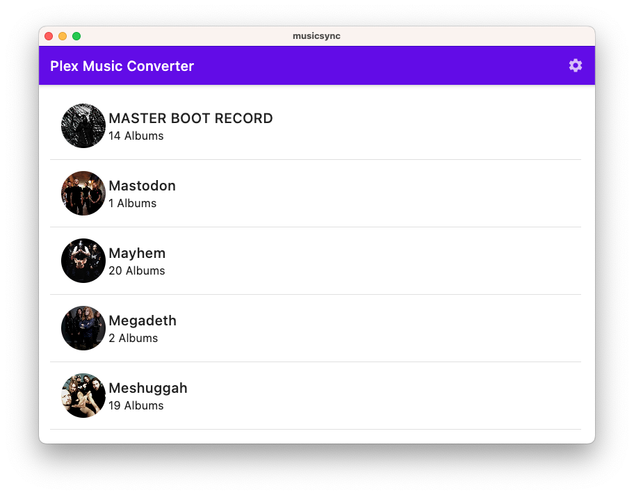
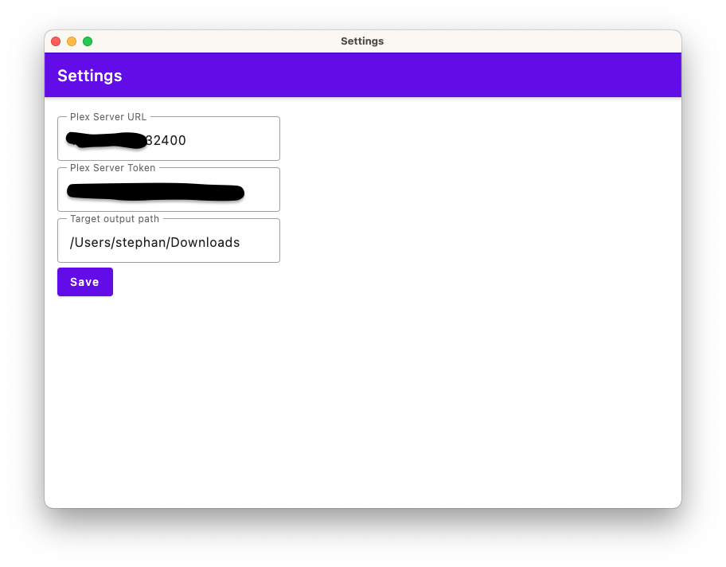
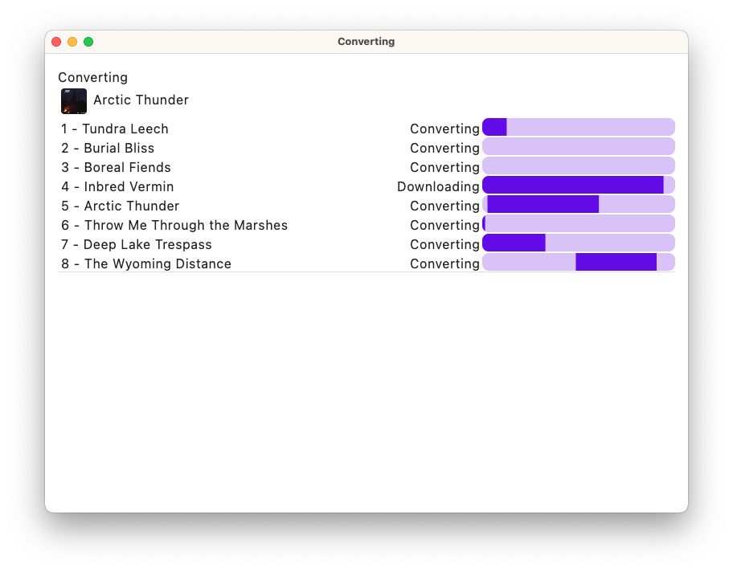

Desktop app to download you flacs from Plex and convert them to mp3s (Using compose multiplatform).

### Why?

I have flacs on my plex server but only an mp3 player with limited storage. Therefore I have to convert the flacs to mp3
in order to get more music on my mp3 player. This is fast and somewhat hacky solution I came up with.

### How to use

1. Enter your plex server address, plex token and download target folder in the settings screen
2. Select the albums you want to download and convert (only flac to mp3 is supported)
3. Click the convert button

